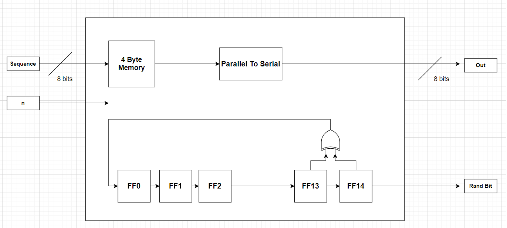
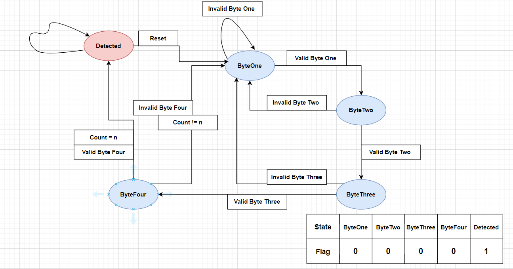
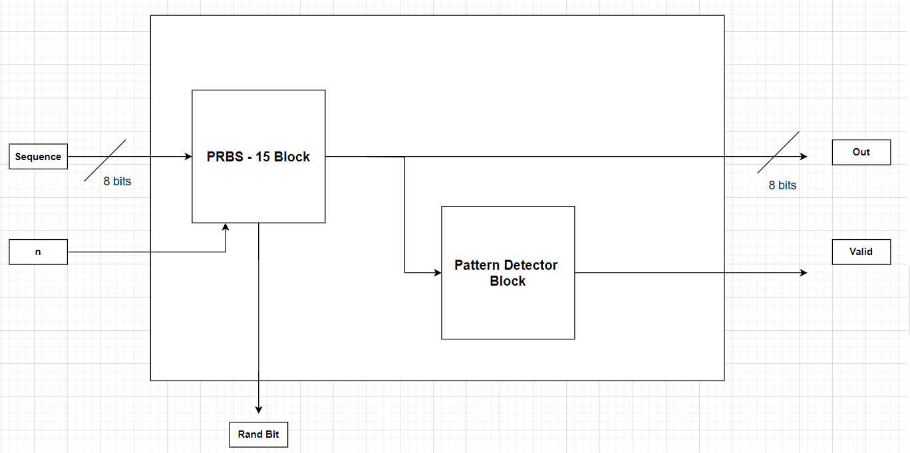
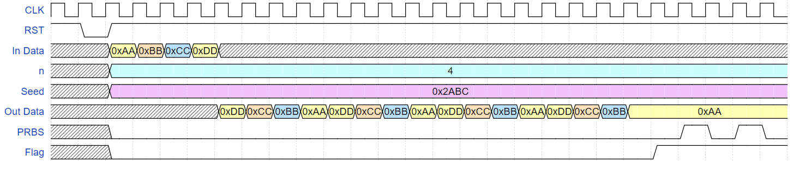
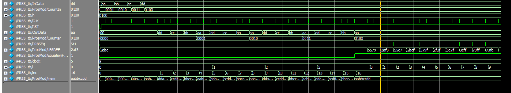
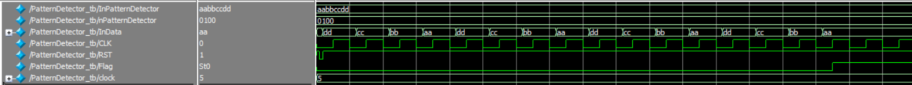
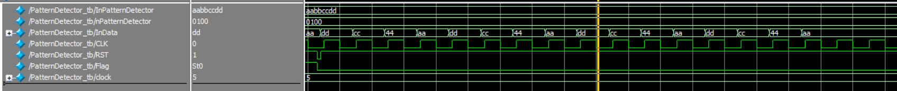
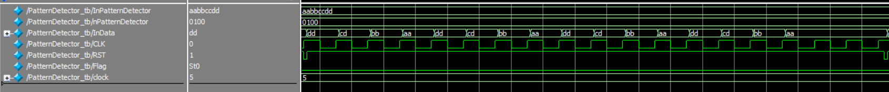
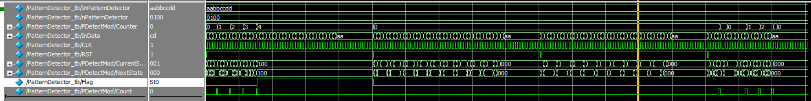
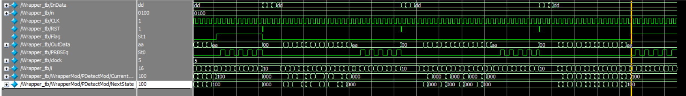

# **PRBS - 15**
## Introduction 
Pseudo-Random Binary Sequence (PRBS) generators are fundamental tools used in digital communication systems, testing, and validation processes. PRBS sequences are binary sequences that appear random but are generated deterministically using a shift register and a specific feedback polynomial. These sequences exhibit properties similar to white noise, making them ideal for testing and analyzing digital systems, especially communication links, to evaluate their performance under various conditions.

---
## Design Methodology
The design consists of two primary blocks: the PRBS-15 generator and the pattern detector.

The PRBS-15 generator block creates a sequence of pseudo-random bytes and outputs them serially, byte by byte, for 
𝑛
n repetitions. This is done using a 15-bit Linear Feedback Shift Register (LFSR), which shifts left each clock cycle. The LFSR updates by XORing the 13th and 14th bits, and the result is stored in the least significant bit (LSB), producing the next random bit for the sequence.

The pattern detector block receives the generated bytes from the PRBS-15 generator and checks them for correctness over 
𝑛
n repetitions. It verifies each byte against the expected PRBS-15 pattern. If all bytes are correct after 
𝑛
n checks, it raises a flag to '1', indicating that the pattern matches without any errors.

*Figure 1: PRBS - 15 Block*

*Figure 2: Pattern Detector FSM*

*Figure 3: Wrapper Block*

*Figure 4: Expected Output*

---
## Simulation and Verification
### Test Case Data :
- Sequence = `32'HAABBCCDD`
- n = `4`
- Random Seed = `0x2ABC`
  

*Figure 5: PRBS Block Test Case 1*

*Figure 6: Pattern Detector Test Case 2*

*Figure 7: Pattern Detector Test Case 3*

*Figure 8: Pattern Detector Test Case 4*

*Figure 9: Pattern Detector All Test Cases*

Figures 4 to 8 present various test cases that evaluate the behavior of the PRBS (Pseudorandom Binary Sequence) generator and Pattern Detector blocks separately. The test cases confirm the correct operation of the PRBS by demonstrating its ability to output the sequence byte-by-byte in a serial manner for n iterations.

Test cases 2 to 5 validate the functionality of the pattern detector, showing that it correctly raises a flag after detecting a pattern 4 times or identifies any byte or bit errors within the sequence.

*Figure 10: Wrapper Detector Test Case 6*

The wrapper's behavior mirrors that of the pattern detector, indicating a successful integration.

---
## FPGA Implementation
- Board Name : Zybo fpga provided by diligent.inc
  
The input was chosen to be 8 bits and then converted to parallel within the PRBS because the Zybo board cannot support a 32-bit input bus.

---
